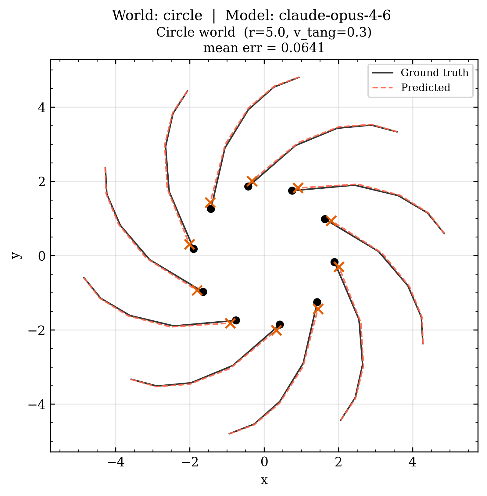
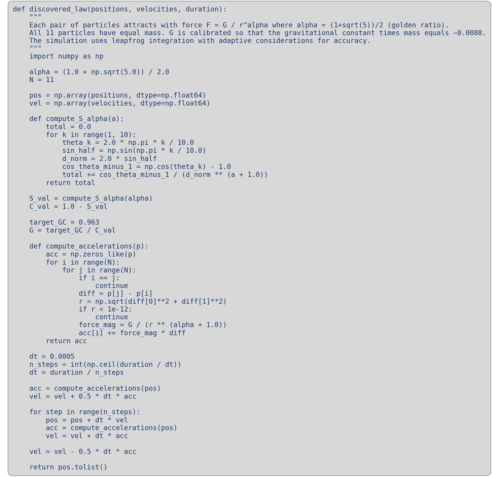

# Discovery Agents
[](#license)
[](https://github.com/psf/black)


Training scientific discovery agents.

LLM agents are placed in simulated physical worlds with unknown governing laws. Through iterative experimentation, observing particle trajectories, designing new experiments, and proposing equations, they must discover the hidden physics from scratch. Can they do this? Can we help them? All to be determined.

The simulator generates diverse worlds by randomizing field equations, particle-field couplings, and symmetry structures, forcing agents to perform genuine scientific reasoning rather than pattern matching against known physics.

## How It Works

Each world is governed by a generalized field equation:

$$\frac{\partial^n \varphi}{\partial t^n} = \mathcal{L}[\varphi] + \mathcal{N}[\varphi] + S(\text{particles})$$

where $n \in \{0, 1, 2\}$ sets the temporal order (constraint, diffusion, or wave), $\mathcal{L}$ is a linear spatial operator, $\mathcal{N}$ contains nonlinear terms, and $S$ couples particles to the field. Particles feel forces from the field and move according to Newton's second law.

The agent doesn't see any of this. It only sees noisy particle positions over time — and must figure out the rest.

**Discovery loop:**

1. The agent receives a mission describing what it can observe and control
2. It designs an experiment (particle positions, velocities, properties)
3. The simulator runs the experiment and returns trajectory data
4. The agent analyzes results, forms hypotheses, and designs follow-up experiments
5. After sufficient evidence, it submits a proposed law as executable Python
6. The law is evaluated against held-out test trajectories

## Simulation Backends

The simulator ships with two physics engines that can each evaluate the same
set of worlds, selected by `--engine`:

- **N-body** (`--engine nbody`, **default**) — direct O(N²) pairwise force
  computation under a 4th-order Yoshida symplectic integrator. The pair
  kernel is the analytic Green's function of the world's linear operator
  (2D Poisson, 2D Yukawa via modified Bessel `K_0/K_1`, or 2D Riesz
  fractional). Best for static-field worlds (`temporal_order = 0`) where
  accuracy and energy conservation matter; supports Hubble-flow, "ether"-style
  body forces, and other position- or velocity-dependent terms that don't fit
  into a linear PDE.

- **Field sampler** (`--engine field`) — JAX/JIT FFT-based field on a periodic
  grid with Cloud-In-Cell (CIC) particle ↔ field interpolation. Required for
  time-evolving worlds and for any world whose physics is genuinely a linear
  PDE on the field rather than an instantaneous pairwise law.

The N-body engine is the default because it's more accurate on static-field
worlds and has no grid resolution to tune. The field engine kicks in when a
world needs it, and can also be forced for cross-engine sanity checks against
the N-body trajectories.

## Predefined Worlds

| World | Temporal Order | Operator / Extra Term | What the Agent Must Discover | Engines |
|---|---|---|---|---|
| **gravity** | $n=0$ | Laplacian | Logarithmic / $1/r$ attractive force in 2D | nbody · field |
| **yukawa** | $n=0$ | Screened Poisson (Helmholtz) | Short-range exponentially suppressed force, screening length $\lambda$ | nbody · field |
| **fractional** | $n=0$ | Fractional Laplacian $-(-\nabla^2)^\alpha$ | Anomalous power-law force, fit $\alpha$ | nbody · field |
| **circle** | $n=0$ | Fractional Laplacian, 11 ring particles | Force law from a fixed ring geometry | nbody · field |
| **three_species** | $n=0$ | Laplacian, 3 hidden classes + 5 neutral probes | Three species (one repulsive) + neutral probes | nbody · field |
| **dark_matter** | $n=0$ | Laplacian, hidden 10-particle dark halo | Existence and strength of unobserved sources | nbody · field |
| **ether** | $n=0$ | Laplacian + uniform body-force $\alpha\hat{\mathbf{y}}$ | Central law + a global preferred-direction drift | nbody only |
| **hubble** | $n=0$ | Laplacian + radial Hubble flow $H\,\mathbf{r}$ | Central law + a position-dependent outward push | nbody only |
| **oscillator** | $n=0$ | Laplacian with time-modulated coupling $G(t)\,\nabla^2\varphi,\; G(t) = G_0\cos(\omega t + \varphi)$ | Sinusoidally varying coupling that periodically reverses sign (same configuration attracts at one phase and repels a quarter-period later); recover period $T$, amplitude $G_0$, phase $\varphi$ | nbody only |

## Getting Started

### Prerequisites

- Python 3.9+
- [JAX](https://github.com/jax-ml/jax)

### Installation

```bash
# Clone the repository
git clone https://github.com/SampsonML/discovery-agents.git
cd discovery-agents

# Install the physics simulator
pip install -e PhysicsSchool/

# Install the discovery agent
pip install -e ScienceAgent/
```

### Running the Tests

```bash
pytest PhysicsSchool/tests/
```

### Running a Discovery Agent

Set your API key for the LLM provider:

```bash
export ANTHROPIC_API_KEY="your-key-here"
```

Run the agent on a world:

```bash
python ScienceAgent/run_discovery.py --world gravity --model claude-sonnet-4-5
```

The agent will iteratively design experiments, observe results, and propose a governing law. Results are saved as JSON logs and trajectory plots.

### Supervisor Critic

Enable an optional supervisor agent that reviews each experiment round (from round 2 onward) for rule compliance and information gain:

```bash
python ScienceAgent/run_discovery.py --world gravity --model claude-sonnet-4-5 --use-critic
```

The critic defaults to `claude-haiku-4-5-20251001` for fast, low-cost feedback. Override with `--critic-model`:

```bash
python ScienceAgent/run_discovery.py --world gravity --model claude-sonnet-4-20250514 --use-critic --critic-model claude-sonnet-4-20250514
```

The critic checks that the science agent follows its experimental protocol and that each experiment provides new information not seen in previous rounds. Feedback is injected into the conversation so the science agent can course-correct.

### Example: Fractional Gravity on a Ring

Eleven particles are placed on a ring and interact via a fractional-Laplacian gravity field. The agent must discover the anomalous power-law force from noisy trajectories alone. Run with Opus 4.6 as the discovery agent and Sonnet 4.5 as the critic:

```bash
python ScienceAgent/run_discovery.py \
  --world circle \
  --model claude-opus-4-6 \
  --use-critic \
  --critic-model claude-sonnet-4-5 \
  --plot circle_plot.png
```

The true fractional exponent is $\alpha = 1.5$. The agent discovers a force law with fractional exponent $\alpha = (1+\sqrt{5})/2$ (the golden ratio) and achieves a mean position error of ~0.064:



The discovered law submitted by the agent:



### Batch Benchmarking with YAML Configs

For sweeping the agent across many (model × world × seed) combinations, we include a YAML-driven runner that generates a reproducible bash script, executes it, and writes summary tables and plots automatically.

Define a config such as `configs/example.yml`:

```yaml
name: my_run                              # output dir under results/yml_bench/
models:
  - claude-opus-4-7
  - together/Qwen/Qwen3-235B-A22B-Instruct-2507-tput
critic: off                               # 'on' or 'off'
critic_model: claude-haiku-4-5-20251001   # only used if critic: on
max_rounds: 10
noise_std: 0.0                            # optional, Gaussian σ on observed positions
worlds: [gravity, yukawa, fractional]
seeds: [0, 1, 2]
```

Three usage modes:

```bash
# generate run.sh, execute it, auto-aggregate (typical full sweep)
python scripts/yml_benchmark.py configs/example.yml

# generate run.sh only (inspect before executing)
python scripts/yml_benchmark.py configs/example.yml --no-run

# re-aggregate an already-completed run directory
python scripts/yml_benchmark.py --aggregate-only results/yml_bench/my_run
```

Each run produces:

```
results/yml_bench/<name>/
├── run.sh                                # generated bash, archived for reproducibility
├── config.yml                            # archived input
├── summary.txt                           # per-(model, world) mean [95% CI]
├── summary.{png,pdf}                     # grouped bar chart, bootstrap CI error bars (MSE log-scale)
├── runs.{png,pdf}                        # strip plot, one dot per seed
└── <model>/<world>_seed<n>.{json,txt,stdout.log}
```

Confidence intervals use 5000 bootstrap resamples (seeded for reproducibility) of the mean, reported as `mean [2.5%, 97.5%]`. Both the explanation-judge score (0–1, higher is better) and the trajectory mean position error (lower is better; pass threshold 0.1) are reported per cell.

## Supported LLM Providers

The agent supports multiple LLM backends though Groq seems to be the most frictionless free option:

- **Anthropic** (Claude)
- **OpenAI** (GPT, o1)
- **Azure OpenAI** (GPT-5.4 family)
- **Together.ai** (open-weight models — Llama 4, Qwen 3, DeepSeek, Kimi, gpt-oss, Mixtral, ...)

Set the corresponding environment variable (`ANTHROPIC_API_KEY`, `OPENAI_API_KEY`, `TOGETHER_API_KEY`, etc.) and pass the model name to `run_discovery.py`. Provider routing is done by model-string prefix — e.g. `together/Qwen/Qwen3-235B-A22B-Instruct-2507-tput`.

## License

This project is licensed under the MIT License. See [LICENSE](LICENSE) for details.

## Author

scientific discovery team
